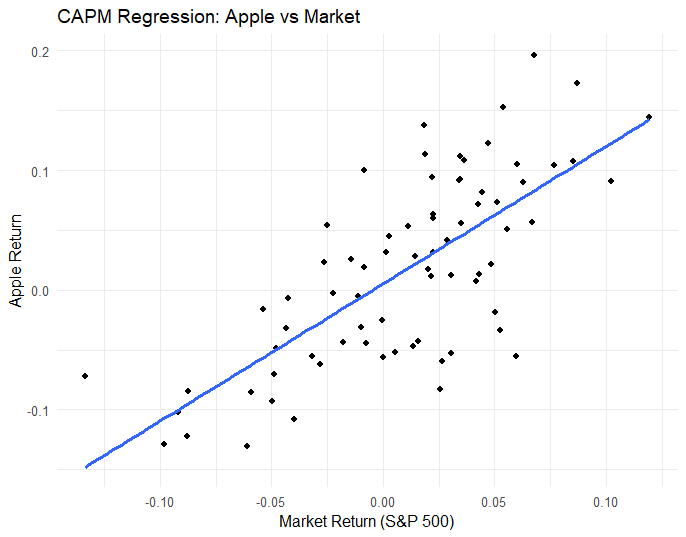

# CAPM Regression Analysis using R

This project analyses Apple stock returns relative to the market (S&P 500) using CAPM regression.

## Objective
To measure the risk (beta) of Apple stock compared to the overall market.

## Steps
- Data collection using tidyquant
- Monthly price conversion
- Log return calculation
- Regression analysis (CAPM)
- Data visualization

## Tools
- R
- tidyquant
- ggplot2

## Results
The regression results show a beta of 1.15, indicating that Apple is more volatile than the market. The model explains approximately 52% of the variation in returns, with strong statistical significance.

## Output

